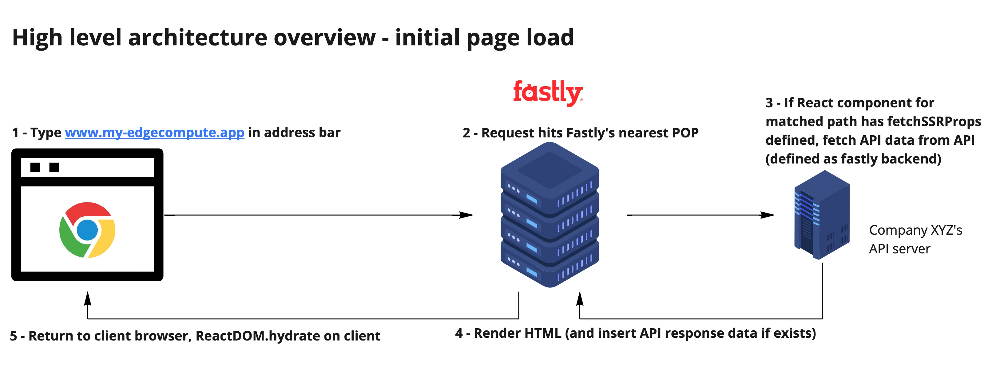
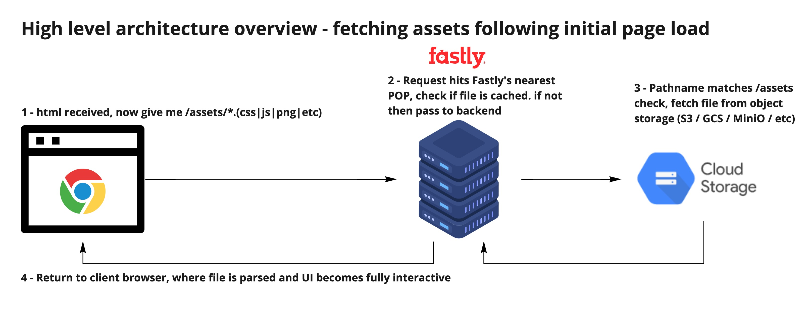
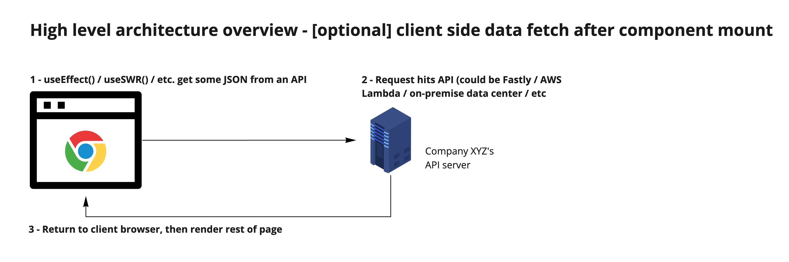

# table of contents

- [how it works](#how-it-works)
  - [fetchSSRProps](#-fetchssrprops-)
  - [fetchFastlyBackend](#-fetchfastlybackend-)
  - [1. initial page load (html render phase)](#1-initial-page-load--html-render-phase-)
  - [2. fetching assets](#2-fetching-assets)
  - [3. [optional] client side data fetching after React component mount](#3--optional--client-side-data-fetching-after-react-component-mount)
- [deployment](#deployment)
  - [1. make -j deploy](#1--make--j-deploy-)
  - [2. check-types](#2--check-types-)
  - [3. build](#3--build-)
  - [4. npm run deploy](#4--npm-run-deploy-)
- [current differences between development and production](#current-differences-between-development-and-production)

**note:** documentation is a work in progress. its currently designed to be read from top to bottom, otherwise context will be missing for the later sections.

## how it works

the diagrams we are going to walk through below give a high level overview of how everything works. theres a few important things to know before we get started:

### `fetchSSRProps`

every "page" of the application can have a `fetchSSRProps` method. This method is in charge of
defining what fastly backend to fetch data from, and what the path is that should be fetched.
`fetchFastlyBackend` is a provided helper function to be used within `fetchSSRProps` that
provides a type-safe solution to define which backend to fetch from, and what the path is.

```typescript jsx
import { fetchFastlyBackend } from "internals";
import { Profile } from "src/app";

interface ProfileProps {
  profile: Profile;
}

ProfilePage.fetchSSRProps = async () => {
  const profile = await fetchFastlyBackend<Profile>("web_api", "/profile");

  return {
    profile,
  };
};

export function ProfilePage({ profile }: ProfileProps) {
  return <>...</>;
}
```

### `fetchFastlyBackend`

this function is just an abstraction on top of the provided `fetch` API to provide a type-safe way to fetch from fastly backends in the
javascript compute@edge runtime. This function is only ever to be used within `fetchSSRProps`, or within the `entry.server.tsx` code. In short, it is not usable
outside of the javascript compute@edge runtime.

More info on what `fetch` is [here](https://developer.fastly.com/learning/compute/javascript/).

```typescript
export const backendConfig = {
  web_api:
    "https://my-json-server.typicode.com/jasonnnnnnnnnnnnn/fastly-react-compute-edge",
  web_static_s3: "https://my-vite-webapp.s3.us-west-2.amazonaws.com",
} as const;

export async function fetchFastlyBackend<Data>(
  backend: keyof typeof backendConfig,
  pathname: `${string}`
) {
  const apiURL = backendConfig[backend] + pathname;
  const res = await fetch(apiURL, { method: "GET", backend });

  return JSON.parse(await res.text());
}
```

now that we've covered the general API available to use, lets go over a real world example and dive into the code, where a user visits the https://slowly-aware-hog.edgecompute.app/profile page.

### 1. initial page load (html render phase)



1. request makes it to the `handleRequest` function defined in the `entry.server.tsx` file.

```typescript
/// <reference types="@fastly/js-compute" />

import React from "react";
import indexHtml from "dist/assets/index.html";
import { fetchAssets } from "internals/utils";
import { renderHtml } from "internals/ssr-handler";

addEventListener("fetch", (event) => event.respondWith(handleRequest(event)));

async function handleRequest({ request }: FetchEvent) {
  if (!["HEAD", "GET"].includes(request.method)) {
    return new Response("This method is not allowed", {
      status: 405,
    });
  }

  // url is https://slowly-aware-hog.edgecompute.app/profile
  const url = new URL(request.url);

  // not an asset, skipping if statement
  if (url.pathname.startsWith("/assets")) {
    return await fetchAssets(url);
  }

  /**
   * the full url is passed to `renderHtml`, along with the html template generated during the
   * client side build process before deployment.
   */
  return new Response(await renderHtml(indexHtml, url), {
    status: 200,
    headers: new Headers({ "Content-Type": "text/html; charset=utf-8" }),
  });
}
```

2. now we make it into the `renderHtml` function. this is where potential data fetching happens server side with `fetchSSRProps`, and where the stringified html output is generated to be sent back to the client.

```typescript jsx
import React from "react";
import ReactDOMServer from "react-dom/server";
import { matchPath, PathMatch } from "react-router";
import { StaticRouter } from "react-router-dom/server";
import { App } from "src/app";
import { routes } from "src/routes";

export async function renderHtml(template: string, url: URL) {
  // potentially render page props, if a fetch function is defined for the page
  const pageProps = await getPageProps(url.pathname);

  /**
   * nothing special here, using a combination of React / React Router to
   * render the correct component for the given url
   */
  const html = ReactDOMServer.renderToString(
    <StaticRouter location={url}>
      <App pageProps={pageProps} />
    </StaticRouter>
  );

  /**
   * now that the html has been created and rendered to a string, insert it into the
   * response to be sent back to the users browser
   *
   * the pageProps need to be passed back to the client as well in order for
   * the React app hydration to function correctly.
   */
  return template
    .replace(/<div id="app"><\/div>/, `<div id="app">${html}</div>`)
    .replace(
      '<script id="__SSR_PROPS__" type="application/json"></script>',
      `<script id="__SSR_PROPS__" type="application/json">${JSON.stringify(
        pageProps
      )}</script>`
    );
}

async function getPageProps(pathname: string) {
  let pathMatch: PathMatch | null;

  /**
   * iterate over the list of routes
   * defined here: https://github.com/jasonnnnnnnnnnnnn/fastly-react-compute-edge/blob/main/web/src/routes.tsx
   *
   * the path match will be set as:
   *   {
   *     path: '/profile',
   *     element: ProfilePage,
   *   },
   *
   * We saw above that the ProfilePage has a `fetchSSRProps` method defined. That will be
   * invoked here, which makes a request to the "web_api" backend at the "/profile" path.
   *
   * In cases where a `fetchSSRProps` method is not defined, or there is no path match,
   * a stringified JSON object will be resolved.
   */
  for (const route of routes) {
    pathMatch = matchPath(route.path, pathname);

    if (pathMatch) {
      const { pathname, params } = pathMatch;
      // @ts-expect-error
      return await (route?.element?.fetchSSRProps?.({ pathname, params }) ||
        Promise.resolve("{}"));
    }
  }

  return Promise.resolve("{}");
}
```

3. the html and (potentially) fetched data has now been sent to the client. the next step is the client side hydration
   of the React app. The "fetching assets" phase technically happens before client side hydration, but we will cover asset fetching separately below. The html below is an end result of all of the above steps.

```html
<!DOCTYPE html>
<html lang="id">
  <head>
    <meta charset="utf-8" />
    <meta
      name="viewport"
      content="width=device-width,initial-scale=1,viewport-fit=cover"
    />
    <title>fastly compute@edge ssr react app</title>
    <link
      rel="stylesheet"
      href="https://cdn.jsdelivr.net/npm/uikit@3.9.4/dist/css/uikit.min.css"
    />
    <script id="__SSR_PROPS__" type="application/json">
      {
        "profile": {
          "name": "my name",
          "email": "my@email.com",
          "street": "123 fake street",
          "city": "san francisco",
          "state": "CA",
          "createdAt": "Dec 4, 2021"
        }
      }
    </script>
    <link href="/assets/client-26fe2f7a0c02e85fc7ba.css" rel="stylesheet" />
  </head>
  <body>
    <div id="app">
      <nav class="uk-navbar-container">
        <div class="uk-navbar-left">
          <ul class="uk-navbar-nav">
            <li>
              <a href="/">Home</a>
            </li>
            <li>
              <a href="/posts">Posts</a>
            </li>
            <li>
              <a href="/profile">Profile</a>
            </li>
            <li>
              <a href="/client-side-fetch">Client Side Fetching Example</a>
            </li>
          </ul>
        </div>
      </nav>
      <h1>profile</h1>
      <ul>
        <li><strong>name :</strong>my name</li>
        <li><strong>email :</strong>my@email.com</li>
        <li><strong>street :</strong>123 fake street</li>
        <li><strong>city :</strong>san francisco</li>
        <li><strong>state :</strong>CA</li>
        <li><strong>createdAt :</strong>Dec 4, 2021</li>
      </ul>
      <a href="/">to home</a>
      <div>
        <a
          href="https://github.com/jasonnnnnnnnnnnnn/fastly-react-compute-edge"
          target="_blank"
          rel="noreferrer nofollow"
          class="EB3JIbeGrGL1W6uw0z77"
          >view code</a
        >
      </div>
    </div>
    <script src="https://cdn.jsdelivr.net/npm/uikit@3.9.4/dist/js/uikit.min.js"></script>
    <!--  the script that contains the entry point for client side hydration lives here. -->
    <script defer="defer" src="/assets/client-debcfd39f7c16f7bea7e.js"></script>
  </body>
</html>
```

4. now we're on the client side in the browser and it's time to "hydrate" the React app, and to render the page component. If you're unfamiliar with what hydration is
   then refer to the React docs [here](https://reactjs.org/docs/react-dom.html#hydrate).

```typescript jsx
import React from "react";
import ReactDOM from "react-dom";
import { BrowserRouter } from "react-router-dom";
import { App } from "src/app";

/**
 * get the serialized props that were fetched server side to
 * be passed into the <App/> component on the client.
 */
const pageProps = JSON.parse(
  document.getElementById("__SSR_PROPS__").textContent
);

ReactDOM.hydrate(
  <BrowserRouter>
    <App pageProps={pageProps} />
  </BrowserRouter>,
  document.getElementById("app")
);

// app.tsx

export function App({ pageProps }: AppProps) {
  return (
    <>
      {renderHeader()}
      <Routes>
        <Route path="*" element={<NotFoundPage />} />
        {routes.map(({ path, element: Element }) => (
          // path is /profile which mapped to the ProfilePage component, which React Router then renders with the props we hydrated client side
          <Route key={path} path={path} element={<Element {...pageProps} />} />
        ))}
      </Routes>
    </>
  );
}

// profile.page.tsx
export function ProfilePage({ profile }: ProfileProps) {
  return (
    <>
      <h1>profile</h1>
      <ul>
        {Object.entries(profile).map(([key, value]) => (
          <li key={key}>
            <strong>{key}:</strong> {value}
          </li>
        ))}
      </ul>
      <Link to="/">to home</Link>
      <div>
        <a
          href="https://github.com/jasonnnnnnnnnnnnn/fastly-react-compute-edge"
          target="_blank"
          rel="noreferrer nofollow"
          className={styles.someClass}
        >
          view code
        </a>
      </div>
    </>
  );
}
```

### 2. fetching assets



fetching assets is much simpler than the SSR request flow. the request for `/assets/path/to/asset.[contenthash].ext` makes it to Fastly,
which then makes a `fetch` request to the `web_static_s3` backend, sets a long-term cache header, and returns it to the client.

```typescript
import React from 'react';
import { fetchAssets } from 'internals/utils';

addEventListener('fetch', (event) => event.respondWith(handleRequest(event)));

async function handleRequest({ request }: FetchEvent) {
  if (!['HEAD', 'GET'].includes(request.method)) {
    return new Response('This method is not allowed', {
      status: 405,
    });
  }

  // url is https://slowly-aware-hog.edgecompute.app/assets/client-fgdasdvas234.js
  const url = new URL(request.url);

  // its an asset, enter fetchAssets
  if (url.pathname.startsWith('/assets')) {
    return await fetchAssets(url);
  }

  ...
}

import { backendConfig } from 'internals/index';

export async function fetchAssets(url: URL) {
  // fetch asset from s3
  const res = await fetch(backendConfig['web_static_s3'] + url.pathname, {
    method: 'GET',
    backend: 'web_static_s3',
  });

  /**
   * return asset and set long term cache header. the asset is content hashed so any changes
   * in future deployments will handle cache busting automatically
    */
  return new Response(await res.text(), {
    status: res.status,
    headers: new Headers({ 'Content-Type': getContentType(url), 'Cache-Control': 'public, max-age=31536000' }),
  });
}

const CONTENT_TYPE_BY_EXTENSION = {
  js: 'application/javascript',
  css: 'text/css',
  png: 'image/png',
  svg: 'image/svg+xml',
} as const;

function getContentType(url: URL) {
  const fileExtension = url.pathname.split('.').slice(-1)[0] as keyof typeof CONTENT_TYPE_BY_EXTENSION;
  const contentType = CONTENT_TYPE_BY_EXTENSION[fileExtension];

  if (!contentType) {
    throw new Error(`Missing content type for: ${fileExtension}`);
  }

  return contentType;
}

```

### 3. [optional] client side data fetching after React component mount



Data fetching client side is a very common data fetching pattern. wont walk through it in
detail but you can refer to the [code](https://github.com/jasonnnnnnnnnnnnn/fastly-react-compute-edge/blob/main/web/src/routes/client-side-fetch/client-side-fetch.page.tsx) or view the page in production [here](https://slowly-aware-hog.edgecompute.app/client-side-fetch) to see an example.

## deployment

### 1. `make -j deploy`

runs `check-types` and `build` in parallel. upon completion of those make tasks, `fastly compute deploy` is ran and the changes are deployed.

### 2. `check-types`

type checking with `tsc`, to verify no typescript compile errors

### 3. `build`

there are two stages to the build phase. first the client side bundle is built. this is done first because the server side bundle needs the
generated html file output to `/dist/assets` from `webpack.client.config.js`.

At a high level, the steps are:

1. bundle client assets, send them to `/dist/assets`
2. import the generated html file from the client build (required because the assets are content hashed to allow for long term caching), and then build the server bundle with a `webworker` target.
3. once webpack is completed, the static assets from the client build (`/assets`) are uploaded to S3. this is done before before the fastly cli specific steps to ensure the assets are available after the deployment is complete.

Refer to the webpack configs for more information specific to the build process.

- [webpack.client.config.js](../web/webpack.client.config.js): for info specific to the client side entry (browser environment)
- [webpack.server.config.js](../web/webpack.server.config.js): for info specific to the server side entry (compute@edge environment)
- [webpack.common.config.js](../web/webpack.common.config.js): configuration shared between each

### 4. `npm run deploy`

once webpack is completed, and assets are uploaded to s3, the `js-compute-runtime` outputs the compiled `.wasm` file which is then uploaded to fastly via the cli. the changes will be live in ~30 seconds.

## current differences between development and production

Rather than bundle the code, execute the fastly-js-runtime, compile to wasm, and restart the local preview server on every file change, the develoment
environment uses [Vite](https://vitejs.dev/) in middleware mode. This allows the use of modern developer tooling like
hot module replacement, instant react component updates on save, and instant development server startup.

i developed a majority of this using the initial approach (takes ~15 seconds each time a change is made). contrast that to the setup with vite dev server where every change made is hot reloaded into the browser in ~50ms. much better experience. worth the tradeoff of parity between development / production environments which will be mitigated by automated testing anyways.

There are a few changes that were needed to get this to work:

- the development environment uses what's defined in `vite.config.ts`. much less configuration required compared to webpack as it's geared towards being a zero config setup. fortunuately this means little to no additional overhead when managing multiple bundlers.
- `template.prod.html` is whats used by `webpack.client.config.js` when bundling code for production. the only difference is the removal of the vite client entry point (shared between vite and webpack) as the production entrypoint gets injected by `HtmlWebpackPlugin` in `webpack.client.config.js`.
- `template.dev.html` is used by the Vite dev server. as mentioned above, the only difference is one module script.
- have not had time to come up with a solution for fake API data in development yet. currently the logic in the `fetchFastlyBackend` function returns static JSON data when in development mode.

everything else is shared between development and production
